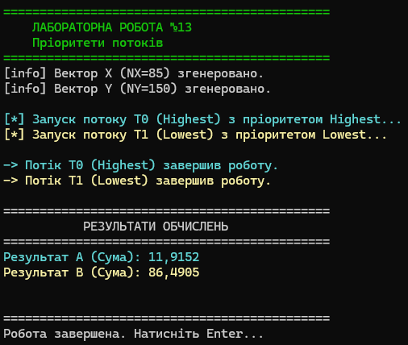

# Лабораторна робота №13: Пріоритети потоків у .NET

**Тема:** Технології розподілених систем та паралельних обчислень.  
**Виконав:** Студент групи І-23, Литвиненко Дмитро (Варіант 8).

## 📝 Опис
Цей проєкт досліджує вплив пріоритетів потоків (`Thread.Priority`) на розподіл процесорного часу в середовищі Windows / .NET. 
Програма виконує паралельні математичні обчислення над векторами даних, демонструючи, як планувальник потоків надає перевагу процесам з вищим пріоритетом.

### 🎯 Завдання (Варіант 8)
Програма генерує два вектори випадкових чисел та запускає два потоки для їх обробки:

| Потік | Пріоритет | Колір | Дані | Завдання |
| :--- | :--- | :--- | :--- | :--- |
| **T0** | `Highest` | 🟦 Cyan | Вектор X (85 елементів) | Сума кубічних коренів: $\sqrt[3]{x \cdot \sin(e \cdot x^2)}$ |
| **T1** | `Lowest` | 🟨 Yellow | Вектор Y (150 елементів) | Сума коренів 4-го степеня: $\sqrt[4]{y \cdot \cos(y^2)}$ |

### ⚙️ Технічні особливості
- **Thread Priority:** Явне встановлення пріоритетів `ThreadPriority.Highest` та `ThreadPriority.Lowest`.
- **Thread Safety:** Використання `lock` для синхронізації доступу до консолі (щоб кольоровий вивід не змішувався).
- **Математична коректність:** Реалізовано захист від `NaN` при обчисленні коренів парного степеня з від'ємних чисел.
- **Штучне навантаження:** Додано `Thread.SpinWait` для симуляції складних обчислень, щоб візуалізатор встиг зафіксувати різницю в роботі потоків.

---

## 📸 Результат роботи
На скріншоті видно ініціалізацію векторів, запуск потоків з різними пріоритетами та фінальні результати обчислень.



*Примітка: Аналіз у "Візуалізаторі паралелізму" показав, що потік T0 (Highest) отримує ~79% процесорного часу, тоді як T1 (Lowest) — лише ~19%.*

---

## 🚀 Як запустити
Вам знадобиться **.NET 8 SDK**.

1. Клонуйте репозиторій:
   ```bash
   git clone https://github.com/Lutvunenko-Dmutro/Lab13-ThreadPriorities-CSharp.git

2.  Перейдіть у папку проєкту:
    ```bash
    cd Lab13-ThreadPriorities-CSharp
    ```
3.  Запустіть проєкт:
    ```bash
    dotnet run
    ```


© 2025 Литвиненко Дмитро
